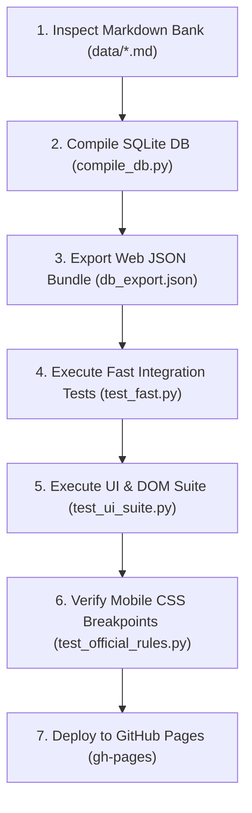

# 🎨 Goa Exam Prep Platform - Comprehensive UI Specifications, Iconography Rules & Implementation Guide

Master specification defining visual design rules for every page section, icon systems, mistake detection rules, minimal UI constraints, and developer implementation workflows for **Goa Government Exam Prep Studio**.

---

## 📐 1. Section-by-Section UI Design Specifications

### 🏛️ Section A: Exam Studio Page (Home / Launch Dashboard)
- **Visual Goal**: Zero clutter, instant test launch within 1 click.
- **Layout Architecture**:
  - **Hero Welcome Banner**: Subtle indigo-purple glassmorphic background (`linear-gradient(135deg, rgba(99, 102, 241, 0.12) 0%, rgba(168, 85, 247, 0.12) 100%)`) with `18px` rounded corners and `1px` active border.
  - **Launch Action Cards Grid**:
    - **Card 1 (Full 100 Qs Exam Arena)**: High-emphasis card featuring `🏛️` icon, bold title, 100-question & 30-min timer badge, and full-width gradient launch button.
    - **Card 2 (Subject Practice Studio)**: Interactive card featuring `⚡` icon, custom stylized `<select>` subject dropdown (`#practice-subject-select`), and a 1-tap **Start** button.
- **Mobile Responsive Behavior**:
  - Desktop (`> 900px`): Cards render side-by-side in a 2-column flex grid.
  - Mobile Phone (`<= 900px`): Cards stack cleanly into a single column with `100vw` margin resets.

### 📝 Section B: Standalone OMR Exam Hall Page (`exam.html`)
- **Visual Goal**: Distraction-free official exam hall simulation matching GPSC/GSSC paper standards.
- **Layout Architecture**:
  - **Header Bar**: Displays `🏛️ GPSC & GSSC Official Exam Arena`, `🔊 Audio ON / OFF` toggle, and `✖ Exit` button.
  - **2-Column Layout (`standalone-omr-grid`)**:
    - **Left Column (`omr-question-card`)**: Current question text, 4 A/B/C/D option choice buttons (`opt-btn`), explanation drawer, and navigation controls (`◄ Previous`, `Next Question ►`, `Finish Test`).
    - **Right Column (`omr-palette`)**: 100-button numeric grid (`palette-grid`) showing answered (green/purple) vs current (cyan outline) questions with max-height scroll (`520px` desktop / `250px` mobile).

### 🧠 Section C: Brain Arcade Tab (`#view-brain-games`)
- **Visual Goal**: High-contrast interactive micro-games to build visual memory & quantitative calculation speed.
- **Games Included**:
  1. **🃏 Memory Match**: 4x4 card grid with 3D flip transform (`transform: rotateY(180deg)`).
  2. **⚡ 60-Second Speed Math Trainer**: High-visibility math calculation display with numerical input box.

### 📚 Section D: Revision & Notes Bank Tab (`#view-revision-bank`)
- **Visual Goal**: Instant searchability across 226+ indexed Goa GK & aptitude questions.
- **Layout Architecture**:
  - **Global Search Input**: Top search bar executing instant keyword search on press of `Enter`.
  - **Subject Chips**: Quick-filter pill buttons (`goa_current_affairs_2026`, `goa_special_gk`, `konkani_rti`, etc.).
  - **Markdown Viewer Box**: Renders structured study notes with custom typography (`Outfit` headings, `Plus Jakarta Sans` body).

---

## 🎨 2. Iconography & Visual Accent Rules

| Element Category | Assigned Emoji / Icon | Color Token / CSS Class | Purpose |
| :--- | :---: | :--- | :--- |
| **Official Exam Arena** | `🏛️` | `var(--primary-gradient)` | Represents official GPSC/GSSC exam hall simulation. |
| **Goa Current Affairs** | `🆕` | `#06b6d4` (`var(--accent-cyan)`) | Highlights 2025-2026 administrative updates (Kushavati 3rd district, ULLAS). |
| **Goa Special GK** | `🏝️` | `#10b981` (`var(--success)`) | Identifies Goa liberation history, geography, and rivers. |
| **Quantitative Aptitude** | `🔢` | `#f59e0b` (`var(--accent-amber)`) | Denotes math formulas, ratios, percentages, and data interpretation. |
| **Konkani & RTI** | `📜` | `#a855f7` | Indicates Konkani vocabulary and Goa RTI 30-day/48-hr rules. |
| **Lifelines** | `🔥 50:50` | `#ef4444` (`var(--error)`) | Triggers removal of 2 incorrect choices. |
| **Timer** | `⏱️ 30:00` | `#f59e0b` | Displays 30-minute exam countdown. |

---

## 🔍 3. Mistake Detection & Common UI Pitfalls to Avoid

> [!CAUTION]
> **Common UI Failure Modes & Prevention Protocols**:
> 1. **Horizontal Scroll Bar Overflow**: Caused when fixed pixel widths (e.g. `width: 1200px` or `margin-left: 260px`) are applied without media query overrides on mobile.  
>    *Prevention Rule*: Always use `max-width: 100%`, `box-sizing: border-box`, and set `margin-left: 0 !important; width: 100vw !important` under `@media (max-width: 900px)`.
> 2. **Overlapping UI Cards**: Occurs when multiple view containers are active simultaneously.  
>    *Prevention Rule*: Strictly enforce `.hidden { display: none !important; }` on unlaunched views.
> 3. **Unresponsive Touch Buttons**: Caused by small touch targets (`< 40px`).  
>    *Prevention Rule*: Enforce `min-height: 48px` on all mobile touch buttons and bottom nav items.

---

## 📏 4. Minimalist Design & Visual Skill Rules

1. **Rule of 2 Cards**: Limit dashboard choices to 2 primary high-impact action cards (*Official Test Arena* vs *Subject Practice Dropdown*).
2. **Subtle Micro-Animations**: Use GPU hardware acceleration (`will-change: transform; transition: transform 0.2s cubic-bezier(0.4, 0, 0.2, 1)`) on card hover states.
3. **Contrast & Legibility**:
   - Primary text: `#f8fafc` on `#090d16` (Contrast ratio > 12:1).
   - Muted text: `#94a3b8` on `#1e293b` (Contrast ratio > 4.5:1).

---

## 📋 5. Implementation & Verification Workflow

---

## 🔗 6. Curated Open-Source GitHub Repositories Index

1. **[ratneshmaurya/Aptitude_Practice_Questions](https://github.com/ratneshmaurya/Aptitude_Practice_Questions)** – Aptitude question banks.
2. **[drsarveshwarbharti/Aptitude-For-Placements](https://github.com/drsarveshwarbharti/Aptitude-For-Placements)** – Placement quantitative logic.
3. **[rohanmistry231/CSE-Aptitude-Test-Practice-Hub](https://github.com/rohanmistry231/CSE-Aptitude-Test-Practice-Hub)** – Difficulty-categorized sets.
4. **[kubowania/memory-game](https://github.com/kubowania/memory-game)** – Memory card matching game pattern.
5. **[ionic-team/capacitor](https://github.com/ionic-team/capacitor)** – Web-to-Native Android container framework.
