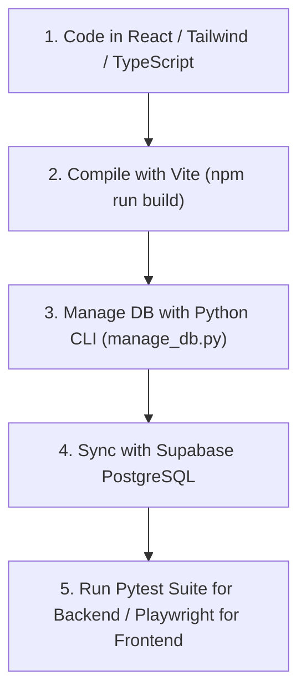

# 🎨 Goa Exam Prep Platform - Modern UI Specifications & Tech Rules

Master specification defining visual design rules, implementation workflows, and architecture constraints for the **Goa Government Exam Prep Studio** using the new modern tech stack (React, Tailwind CSS, Supabase, TypeScript).

---

## 📐 1. Section-by-Section UI Design Specifications

### 🏛️ Section A: Exam Studio Dashboard (React Route: `/`)
- **Visual Goal**: Zero clutter, instant test launch within 1 click.
- **Layout Architecture**:
  - **Hero Welcome Banner**: Use Tailwind glassmorphism (`bg-gradient-to-br from-indigo-500/10 to-purple-500/10 backdrop-blur-md rounded-2xl border border-white/20`).
  - **Launch Action Cards Grid**:
    - **Card 1 (Full 100 Qs Exam Arena)**: High-emphasis card featuring `🏛️` icon, built using reusable React `<ActionCard />` components.
    - **Card 2 (Subject Practice Studio)**: Interactive dropdown driven by React State.
- **Mobile Responsive Behavior**: Built inherently with Tailwind (`flex-col md:flex-row`).

### 📝 Section B: Standalone OMR Exam Hall (React Route: `/exam`)
- **Visual Goal**: Distraction-free official exam hall simulation.
- **Layout Architecture**:
  - **Header Bar**: Fixed top navigation with global state for Audio and Exit controls.
  - **50:50 Lifeline Support**: Interactive `🔥 50:50 Lifeline` button eliminating 2 incorrect choices per question.
  - **Post-Exam Score Modal**: Detailed visual score breakdown modal showing Accuracy %, XP earned, and Subject performance breakdown instead of basic browser alerts.
  - **2-Column Layout (`grid grid-cols-1 md:grid-cols-3`)**:
    - **Left Column (Questions)**: `<QuestionCard />` component taking 2 columns on desktop.
    - **Right Column (OMR Palette)**: `<OMRPalette />` taking 1 column, mapping state over the 100 question buttons.

---

## 🎨 2. Iconography & Visual Accent Rules (Tailwind)

| Element Category | Assigned Emoji / Icon | Tailwind Color Token |
| :--- | :---: | :--- |
| **Official Exam Arena** | `🏛️` | `bg-gradient-to-r from-indigo-500 to-purple-500` |
| **Goa Current Affairs** | `🆕` | `text-cyan-500` |
| **Goa Special GK** | `🏝️` | `text-emerald-500` |
| **Quantitative Aptitude** | `🔢` | `text-amber-500` |
| **Lifelines** | `🔥 50:50` | `text-red-500 hover:bg-red-500/10` |

---

## 🔍 3. Common UI Pitfalls to Avoid in React/Tailwind

> [!CAUTION]
> **Common Framework Failure Modes**:
> 1. **Horizontal Scroll Bar Overflow**: Prevent this by avoiding explicit `w-[1200px]`. Always use `w-full max-w-7xl mx-auto`.
> 2. **State Desyncs**: Never mutate state directly (`state.xp = 5`). Always use `setXp(prev => prev + 5)` via React `useState` or Zustand.
> 3. **Unresponsive Touch Buttons**: Enforce `min-h-[48px]` on all mobile touch targets for accessibility.

---

## 📋 4. Modern Implementation & Verification Workflow

## 🎨 4. Open-Source Icons & Asset System

We strictly use **[`lucide-react`](https://lucide.dev/)** (MIT License), an active open-source vector icon library providing clean, scalable SVG icons:
- **Navigation & Brand**: `<Palmtree />`, `<Landmark />`, `<Brain />`, `<BookOpen />`
- **Stats & Gamification**: `<Medal />`, `<Zap />`, `<Flame />`, `<Clock />`, `<Trophy />`
- **Controls & Actions**: `<Volume2 />`, `<VolumeX />`, `<Search />`, `<Bookmark />`, `<Rocket />`

---

## 🔗 5. Curated Open-Source Integrations

1. **[Vite](https://vitejs.dev/)** – Next Generation Frontend Tooling.
2. **[Tailwind CSS](https://tailwindcss.com/)** – Rapid utility-first CSS framework.
3. **[Lucide Icons](https://lucide.dev/)** – Crisp, open-source vector SVG icons (MIT Licensed).
4. **[Supabase](https://supabase.com/)** – The open-source Firebase alternative. leaderboard modal displaying candidate rankings based on cumulative XP and streak badges.
3. **📲 Offline Progressive Web App (PWA)**:
   - Configure service workers for offline caching of question banks and assets.

---

## 🚀 6. Future Strategic UI Roadmap & Specifications

1. **📊 SVG Visual Analytics**:
   - Render zero-dependency SVG bar charts tracking subject-wise accuracy scores per user session.
2. **🏆 Statewide Cloud Leaderboard**:
   - Provide a real-time leaderboard modal displaying candidate rankings based on cumulative XP and streak badges.
3. **📲 Offline Progressive Web App (PWA)**:
   - Configure service workers for offline caching of question banks and assets.
